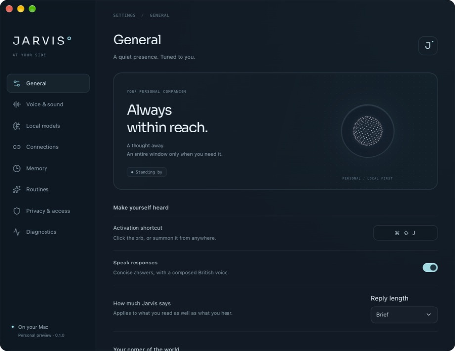

# Jarvis

A local-first Electron companion for macOS 26+ on Apple silicon.



The floating orb keeps Jarvis within reach; Settings is the full window for voice, models, connections, and memory. This is a personal preview. Wake reliability, natural interruption, and local response latency are still being improved; see [verification status](verification/STATUS.md) for what has actually been tested.

## Development

```sh
pnpm install
pnpm native:build
pnpm dev
```

`Command–Shift–J` opens voice interaction. The floating orb is the main interface; its menu opens Settings or compact task/conversation panels. Provider connections, projects, local models, a notes folder to recall from, and privacy settings are managed in the Settings window.

## Natural conversation and actions

In Settings → Voice & sound, use **Enable natural conversation** after the local models pass their checks. It enables “Hey Jarvis” and “Jarvis,” automatic turn completion, hands-free follow-ups, interruption, and Brief replies. Install and check **Custom Wake Name** to choose another name under **Wake name**. Use **Test wake name** to distinguish recognition from a microphone that is merely open. Saying just the name opens a follow-up turn. The pipeline stays local. Silence returns it to wake standby; “Stop talking” or “Go to sleep” ends the current conversation.

Choose a trusted project before asking Jarvis to work. The local agent can inspect files, propose exact commands in an isolated worktree, and use a connected MCP server. Effects retain the existing approval and receipt flow. Changes need the project's configured checks before completion. To add an Agent Skills package, place its directory in the selected project and ask Jarvis to install that skill; Settings → Connections lists installed skills. This does not import arbitrary executable plugin bundles or grant system-wide installation.

OpenAI Realtime is an optional voice engine in Connections. Connect a key, configure a usage ceiling, and select it in Voice & sound. Local-only privacy mode blocks it. Live hosted tests now cover synthesized speech, automatic turn endings, native playback, interruption and a read-only tool response; human microphone qualification remains separate. Reported usage is an estimate, not an account billing cap.

See [the current voice and agent review](verification/VOICE-AND-AGENT-REVIEW.md) for model comparisons, measured results, and remaining release gates.

## Checks and packaging

```sh
pnpm typecheck
pnpm test
pnpm package
```

`pnpm models:setup` prepares the pinned Python model runtime. Model weights are downloaded explicitly through the app. `pnpm dist` creates distributable artifacts; signing and notarization are validated separately.

The task service is authoritative for approvals, revisions, effects, and completion. Renderer state is a projection. Model and provider workers communicate through bounded protocols. See DESIGN.md and UX-CONTRACT.md for visual and behavioral ownership, and verification/STATUS.md for observed qualification results.

The additional integration harnesses are:

```sh
node scripts/verify-app.mjs
node --import tsx scripts/verify-local-agent.ts
node --import tsx scripts/verify-wake-stream.ts
node --import tsx scripts/verify-keyword.ts
node --import tsx scripts/verify-local-conversation.ts
node --import tsx scripts/verify-voice-lifecycle.ts
```

The app harness normally uses a disposable profile linked to existing model weights. Its `--installed-voice` flag deliberately tests the signed installation with the user's profile and enables natural local conversation; it is intended for an authorized personal setup. Real-model agent tests use temporary repositories and approve only their exact harmless fixture actions. Human speech and paid provider checks are identified separately in the evidence.
